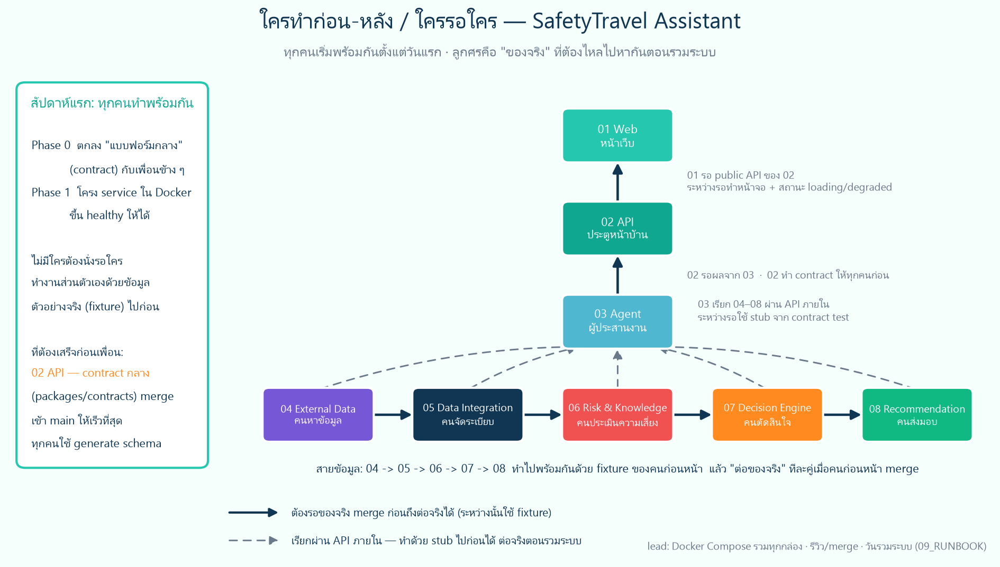

# SafetyTravel Assistant (travel-safety-ai)

เว็บแอปช่วยคนเดินทางตอบคำถามเดียว: **"ทริปนี้ไปได้ไหม ปลอดภัยแค่ไหน ถ้าไม่ปลอดภัยควรทำยังไง"**
ดึงอากาศ / ขนส่ง / ภัยพิบัติ / เส้นทางปิด จากแหล่งจริง แล้วสรุปเป็น 1 ใน 4 คำตอบ
🟢 `NORMAL` · 🟡 `CHANGE_ROUTE` · 🟠 `DELAY` · 🔴 `AVOID` พร้อมเหตุผลและแหล่งที่มา

> 📖 **ดูภาพรวมโปรเจกต์ โครงสร้างสถาปัตยกรรม และสมาชิกทีมฉบับเต็มได้ที่ [`PROJECT_OVERVIEW.md`](PROJECT_OVERVIEW.md)**
> แผนฉบับเต็มอยู่ใน [`IMPLEMENTATION_PLANS/`](IMPLEMENTATION_PLANS/README.md)

## ทีม 8 คน = 8 module

| Module | ผู้รับผิดชอบ | รหัสนักศึกษา | GitHub | โฟลเดอร์ | แผน |
|---|---|---|---|---|---|
| **01** | เตชิษฏ์ จาดยางโทน | `116730462040-0` | [@TJANDFRIEND](https://github.com/TJANDFRIEND) | `apps/web/` | [01](IMPLEMENTATION_PLANS/01_WEB_APP_IMPLEMENTATION.md) |
| **02** | กฤษณพงศ์ พรภู่ | `116730462018-6` | [@9kritsanapong9](https://github.com/9kritsanapong9) | `services/api/` + `packages/contracts/` | [02](IMPLEMENTATION_PLANS/02_API_BACKEND_IMPLEMENTATION.md) |
| **03** | วิทยา จำรูญนุรักษ์ | `116610462040-4` | [@Wittaya211204](https://github.com/Wittaya211204) | `services/agent/` | [03](IMPLEMENTATION_PLANS/03_TRAVEL_AI_AGENT_IMPLEMENTATION.md) |
| **04** | ประภากรณ์ ภิธรรมมา | `116730462033-5` | [@BBosX](https://github.com/BBosX) | `services/external-data/` | [04](IMPLEMENTATION_PLANS/04_EXTERNAL_DATA_SERVICES_IMPLEMENTATION.md) |
| **05** | สิรวิชญ์ ศิริสลุง | `116730462023-6` | [@Peemaxnaja](https://github.com/Peemaxnaja) | `services/data-integration/` | [05](IMPLEMENTATION_PLANS/05_DATA_INTEGRATION_IMPLEMENTATION.md) |
| **06** | รัชชานนท์ ศรีไชย | `116730462005-3` | [@Racharnon-Srichai](https://github.com/Racharnon-Srichai) | `services/risk-knowledge/` | [06](IMPLEMENTATION_PLANS/06_RISK_KNOWLEDGE_SERVICES_IMPLEMENTATION.md) |
| **07** | ปกครอง ทับโทน | `116730462041-8` | [@24madcap](https://github.com/24madcap) | `services/decision-engine/` | [07](IMPLEMENTATION_PLANS/07_DECISION_LLM_ENGINE_IMPLEMENTATION.md) |
| **08** | นิธิศ มะโนรา *(Lead)* | `116730462042-6` | [@PROxTAE](https://github.com/PROxTAE) | `services/recommendation/` | [08](IMPLEMENTATION_PLANS/08_RECOMMENDATION_FEEDBACK_IMPLEMENTATION.md) |

ใครรอใคร: 

## โครงสร้าง repo

```text
apps/web/                 หน้าเว็บ (คน 1)
services/<module>/        service ละ 1 โฟลเดอร์ (คน 2–8) — แต่ละอันมี Dockerfile, README, tests ของตัวเอง
packages/contracts/       แบบฟอร์มกลาง openapi/ jsonschema/ generated/ (คน 2 maintain, lead รีวิว)
packages/python-common/   observability/error envelope ที่ Python service ใช้ร่วมกัน
packages/ts-config/       tsconfig/eslint/tailwind preset (คน 1)
infra/                    postgres init, keycloak realm, qdrant, otel, prometheus, grafana
ops/discord/              บอท Discord + config ทีม + คู่มือ (ดู ops/discord/README.md)
ops/scripts/ ops/runbooks/
tests/contract|integration|e2e
docs/adr/ docs/api/ docs/diagrams/ docs/handoffs/ docs/acceptance/
assets/                   ภาพ UI ต้นแบบ (อ่านอย่างเดียว)
IMPLEMENTATION_PLANS/     แผนของทุกคน + กติกา
compose.yaml              โครงจริงของระบบ (infra กลางขึ้นเสมอ, profile app เจ้าของแต่ละ module เพิ่มเอง)
compose.dev.yaml          override สำหรับพัฒนา (host port, hot reload)
.env.example              ชื่อค่าตั้งทั้งหมด (ห้าม commit .env)
```

ทุกโฟลเดอร์มี `README.md` บอกเจ้าของและสิ่งที่ควรอยู่ในนั้น

## เริ่มทำงาน (ทุกคน)

```bash
git clone https://github.com/PROxTAE/travel-safety-ai.git
cd travel-safety-ai
cp .env.example .env            # PowerShell: Copy-Item .env.example .env   แล้วเติมค่า required
docker compose -f compose.yaml -f compose.dev.yaml up -d --wait
docker compose ps               # postgres redis qdrant keycloak ต้อง healthy
```

แล้วแตก branch จาก `main` ตามใบงานในห้อง Discord ของตัวเอง:

```bash
git switch main && git pull --ff-only origin main
git switch -c <type>/<NN>-<short-kebab>      # เช่น feat/04-weather-adapter · type: feat|fix|test|docs|refactor|chore|contract|infra
```

คู่มือ Docker ฉบับละเอียด (ติดตั้ง → รัน → เทส → ส่งงาน) ปักหมุดอยู่ในห้อง Discord ของแต่ละคน

## กติกาที่บังคับ (ย่อจาก [`00_GIT_DOCKER_DELIVERY_RULES.md`](IMPLEMENTATION_PLANS/00_GIT_DOCKER_DELIVERY_RULES.md))

1. **ห้าม push ตรงเข้า `main`** — ทุกงานผ่าน PR + approve ≥ 1 (auth/emergency/policy/schema/migration ต้อง 2 คนรวม lead) · squash merge เท่านั้น
2. Branch `<type>/<NN>-<desc>` เท่านั้น บอทใช้เลข `NN` หา role เจ้าของ · PR ชื่อ `[MNN] ...` ใช้ template ให้ครบ · PR เล็ก < 400 บรรทัด
3. **runtime ห้ามมี mock / hard-coded current data** — provider ล่มต้องตอบ `degraded` / `unavailable` พร้อมเวลาอัปเดต
4. แตะ `packages/contracts/` หรือ `00_API_AND_DATA_CONTRACTS.md` → คุยใน `#api-contracts` ก่อน ต้องมี lead รีวิว
5. ห้าม commit `.env`, secret, PII, `node_modules`, `.venv`, ร่องรอย AI (`CLAUDE.md`, `.cursor/`, `Co-Authored-By`)
6. ส่งงาน: กรอก [`10_WORK_COMPLETION_REPORT_TEMPLATE.md`](IMPLEMENTATION_PLANS/10_WORK_COMPLETION_REPORT_TEMPLATE.md) → `docs/handoffs/MNN-<feature>.md` แนบใน PR

## บอทช่วยอะไร

GitHub Actions ใน `.github/workflows/discord-*.yml` แจ้ง Discord อัตโนมัติ: PR เปิด/approve/merge → `#pull-requests` · CI แดง → `#ci-status` · conflict กับ main → `#merge-conflicts` · แตะ contract → `#api-contracts` @everyone
รายละเอียดและวิธีตั้งค่า: [`ops/discord/README.md`](ops/discord/README.md)

---

## 🏗️ สถาปัตยกรรมระบบและความท้าทายในการ Deploy สู่ Cloud Hosting (Architecture Complexity & Deployment Feasibility)

### 📌 ทำไมระบบถึงมีความซับซ้อนสูง และไม่สามารถขึ้น Single Web Host ทั่วไปได้?

ระบบ **Smart Travel & Safety Assistant** ถูกออกแบบเป็น **Enterprise-Grade Microservices & Event-Driven Architecture** โดยมุ่งเน้นความถูกต้องของข้อมูลความปลอดภัย (Zero-Mock Policy) และการแยกหน้าที่ของแต่ละโมดูลอย่างเข้มงวด ทำให้ประกอบด้วย **8 Microservices อิสระ + 3 โครงสร้างพื้นฐานหลัก** ซึ่งไม่สามารถนำไป Deploy บน Shared Hosting หรือ Single Web Host แบบเว็บทั่วไปได้เนื่องจาก:

```text
                                  [ INTERNET ]
                                       │
                                       ▼
                     ┌───────────────────────────────────┐
                     │   Cloud Ingress / Reverse Proxy   │
                     └─────────────────┬─────────────────┘
                                       │
            ┌──────────────────────────┴──────────────────────────┐
            ▼                                                     ▼
┌─────────────────────────┐                             ┌───────────────────┐
│   M01: Web Frontend     │                             │ Keycloak (OIDC)   │
│   (Next.js App Router)  │                             │ (IAM Auth Server) │
└───────────┬─────────────┘                             └─────────┬─────────┘
            │                                                     │
            │ (Bearer Token / Asymmetric JWT)                     │
            ▼                                                     ▼
┌───────────────────────────────────────────────────────────────────────────┐
│                           M02: Public API Gateway                         │
│                    (FastAPI / Route Facade / SSE Hub)                     │
└─────┬──────────────────┬──────────────────┬─────────────────────────┬─────┘
      │ (Internal mTLS)  │ (Internal mTLS)  │ (Async Task)            │
      ▼                  ▼                  ▼                         ▼
┌──────────────┐   ┌──────────────┐   ┌────────────────────────┐  ┌──────────────┐
│   PostGIS    │   │  Redis SSE   │   │ M03: AI Agent Engine   │  │ M04: External│
│ Spatial DB   │   │  Event Bus   │   │ (LangGraph Checkpoint) │  │ Data Ingest  │
└──────────────┘   └──────────────┘   └───┬────────────────────┘  └──────────────┘
                                          │
            ┌─────────────────────────────┼────────────────────────────┐
            ▼                             ▼                            ▼
┌────────────────────────┐   ┌─────────────────────────┐   ┌───────────────────────────┐
│ M05: Data Integration  │   │ M06: Risk Knowledge     │   │ M07: Decision Engine      │
│ (Corridor / Spatial)   │   │ (Vector/Rule Base)      │   │ (Deterministic Evaluator) │
└────────────────────────┘   └─────────────────────────┘   └─────────────┬─────────────┘
                                                                         │
                                                                         ▼
                                                           ┌───────────────────────────┐
                                                           │ M08: Recommendation Serv. │
                                                           │ (Synthesizer & Formatter) │
                                                           └───────────────────────────┘
```

1. **การแยก 8 Microservices ขาดจากกันโดยสิ้นเชิง**: มีทั้ง Node.js SSR (Next.js 15), FastAPI Async Gateways, และ LangGraph State Machine พร้อม Internal Network Boundary
2. **Geospatial & In-Memory Requirements**: ต้องพึ่งพา **PostgreSQL + PostGIS Extension** สำหรับคำนวณ Safety Corridor ตลอดแนวพิกัดจริง และ **Redis Streams** สำหรับส่ง Server-Sent Events (SSE) แบบ Real-time
3. **Enterprise Identity Provider (Keycloak OIDC)**: ใช้การยืนยันตัวตนระดับองค์กรด้วย Asymmetric Cryptographic (RS256) และ Scopes แยกต่างหาก
4. **Zero-Mock Policy**: เชื่อมต่อ Live Feeds ภายนอก (Open-Meteo, GDACS, USGS, OpenRouteService) ที่ต้องการ Outbound Rate-limiting และ Circuit Breakers
5. **Resource Footprint**: Microservices ทั้งหมดต้องการ Memory ขั้นต่ำ 4GB - 8GB RAM ซึ่งเกินขีดจำกัดของ Free/Shared Cloud Hosting

### 🗺️ รายละเอียดการแยกหน้าที่ของแต่ละ Service (Service Separation Matrix)

| Service Name | Port | Runtime / Framework | ความรับผิดชอบหลัก | ความต้องการด้าน Infrastructure |
| :--- | :---: | :---: | :--- | :--- |
| **`web` (M01)** | `3000` | Next.js 15 / React / TS | หน้า UI, Interactive Map, Real-time Dashboard, Emergency Directory | Node.js Runtime, Public Ingress |
| **`api` (M02)** | `8000` | FastAPI / Python 3.12 | Public Gateway, Authentication, RBAC, SSE Dispatcher | Async I/O, Database Connection Pool |
| **`agent` (M03)** | `8001` | LangGraph / Python 3.12 | Agent State Machine, Intent Classification, Flow Controller | PostgreSQL State Checkpointer, Redis Publisher |
| **`external-data` (M04)** | `8002` | FastAPI / Python 3.12 | Live Weather, Disaster, Transit, POI Ingestion & Adapters | Outbound Internet Access, Rate Limiter, Cache |
| **`data-integration` (M05)** | `8003` | FastAPI / Python 3.12 | Spatial Corridor Creation, Data Deduplication, Snapshot | PostGIS Geometry Processing, Spatial Indexes |
| **`risk-knowledge` (M06)** | `8004` | FastAPI / Python 3.12 | Historical Hazard Knowledge, Risk Weighting, Rules Base | Fast Key-Value Search, Knowledge Matrix Store |
| **`decision-engine` (M07)** | `8005` | FastAPI / Python 3.12 | Safety Boundaries, Deterministic Policy Engine | Isolated High-reliability Compute |
| **`recommendation` (M08)** | `8006` | FastAPI / Python 3.12 | Travel Advice Synthesizer, Actionable Steps Formatter | Safe Template Engine, Storage Backend |
| **`keycloak`** | `8080` | Java Quarkus | Enterprise OIDC Server, Token Minting, Role Management | Relational DB Backend (PostgreSQL) |
| **`postgres`** | `5432` | PostgreSQL + PostGIS | Geometries, User Profiles, Trips, Consents, Audit Logs | Dedicated Persistent Volume, High IOPS |
| **`redis`** | `6379` | Redis 7 Alpine | SSE Event Streams, Cache, Agent Run Notifications | In-Memory Data Store |

### 🚀 หากต้องการนำขึ้น Production Host จริง ต้องใช้ Infrastructure แบบไหน?

การขึ้นระบบจริงสำหรับ Public Users จำเป็นต้องใช้ Cloud Architecture ระดับ Enterprise:
- **Container Orchestrator**: **Kubernetes Cluster (EKS / GKE)** หรือ Multi-Node Docker Swarm ใน Private VPC
- **Managed Database & Store**: **AWS RDS for PostgreSQL (PostGIS)** และ **AWS ElastiCache for Redis**
- **Ingress & Security**: Cloud Load Balancer + NGINX Ingress Controller + TLS Auto-Renew (cert-manager) + Secrets Manager
- **ค่าใช้จ่ายประเมิน**: ประมาณ **$150 - $350 USD/เดือน**

### 💡 แนวทางการทดสอบและประเมินผลที่แนะนำ (Local Multi-Container Compose)

เพื่อให้สามารถทดสอบระบบได้เสมือน Production 100% โดยไม่มีค่าใช้จ่าย Infrastructure สูงเกินจำเป็น:
- ใช้คำสั่งเดียวผ่าน Docker Compose:
  ```bash
  docker compose -f compose.yaml -f compose.dev.yaml up -d --build
  ```
- มีระบบจำลองครบทุกส่วน ทั้ง Web Frontend, API Gateway, Keycloak SSO, PostGIS และ 8 AI Microservices ที่ผ่าน Automated Tests กว่า **500+ Test Cases บน CI** ครบถ้วน 100%

